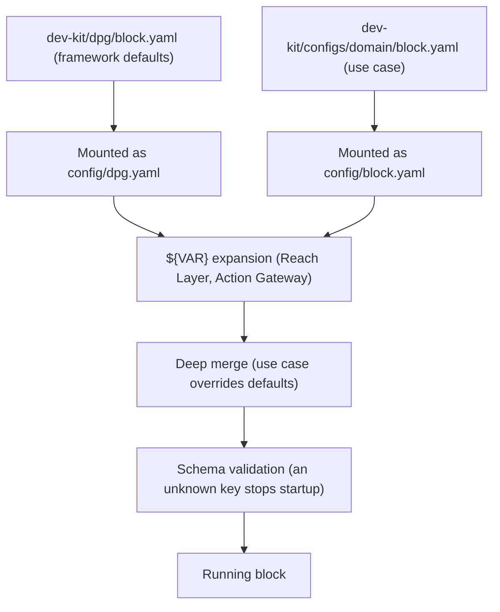

# AI Diffusion DPG — contributor map

This file tells you where things are in the code. For the full architecture, see the Architecture page on the docs site: https://blue-dots-economy.github.io/bluedots-docs/.

## Blocks in the code

| Block | Directory | Entry point | Config schema | Dev-kit mirror |
|---|---|---|---|---|
| Agent Core (8000) | `agent_core/` | `agent_core/main.py`, `agent_core/src/servers/orchestration_server.py` | `agent_core/src/schema/config.py` | `dev-kit/dev_kit/schemas/dpg/agent_core.py`, `dev-kit/dev_kit/schemas/domain/agent_core.py` |
| Knowledge Engine (8001) | `knowledge_engine/` | `knowledge_engine/main.py` | `knowledge_engine/src/schema/config.py` | `dev-kit/dev_kit/schemas/dpg/knowledge_engine.py`, `dev-kit/dev_kit/schemas/domain/knowledge_engine.py` |
| Memory Layer (8002) | `memory_layer/` | `memory_layer/main.py`, `memory_layer/src/server.py` | `memory_layer/src/schema/config.py` | `dev-kit/dev_kit/schemas/dpg/memory_layer.py`, `dev-kit/dev_kit/schemas/domain/memory_layer.py` |
| Trust Layer (8003) | `trust_layer/` | `trust_layer/main.py`, `trust_layer/src/server.py` | `trust_layer/src/schema/config.py` | `dev-kit/dev_kit/schemas/dpg/trust_layer.py`, `dev-kit/dev_kit/schemas/domain/trust_layer.py` |
| Observability Layer (8004) | `observability_layer/` | `observability_layer/main.py`, `observability_layer/src/server.py` | `observability_layer/src/schema/config.py` | `dev-kit/dev_kit/schemas/dpg/observability_layer.py`, `dev-kit/dev_kit/schemas/domain/observability_layer.py` |
| Reach Layer (8005–8008) | `reach_layer/` (one subdirectory per channel: web, voice, mcp, bridge, cli) | `reach_layer/web/server.py`, `reach_layer/voice/server.py`, `reach_layer/mcp/main.py`, `reach_layer/bridge/main.py` | `reach_layer/base/schema/config.py` | `dev-kit/dev_kit/schemas/dpg/reach_layer.py`, `dev-kit/dev_kit/schemas/domain/reach_layer.py` |
| Action Gateway (9999) | `action_gateway/` | `action_gateway/main.py`, `action_gateway/src/server.py` | `action_gateway/src/schema/config.py` | `dev-kit/dev_kit/schemas/dpg/action_gateway.py`, `dev-kit/dev_kit/schemas/domain/action_gateway.py` |
| dev-kit (8080) | `dev-kit/` | `dev-kit/dev_kit/` | — | — |

Framework defaults for each block live in `dev-kit/dpg/`; the Blue Dots use case is in `dev-kit/configs/blue-dots/`.

## Following a turn in the code

`Orchestrator` in `agent_core/src/orchestrator.py` logs a `[STEP n]` marker at each stage. The synchronous path is `_process_turn_inner`; the streaming path is `stream_turn`, which calls `_stream_turn_impl`. Both are in that file. Search for the marker to find the code.

| Marker | What happens | Function (all in `agent_core/src/orchestrator.py` unless noted) |
|---|---|---|
| `[STEP 1]` | Fetch the context bundle from Memory Layer. | `_process_turn_inner`, `_stream_turn_impl` |
| `[STEP 1b]` | Session bootstrap: fetch profile fields before the first turn. | `_run_session_bootstrap_sync`, `_run_session_bootstrap_async`; logic in `agent_core/src/session_bootstrap.py` |
| `[STEP 2]` | Resolve the current subagent; special handlers (human handoff, WhatsApp handoff) short-circuit the turn. | `_process_turn_inner`, `_stream_turn_impl`, `_handle_special` |
| `[STEP 3]` | Trust Layer input check; may block or escalate. | `_process_turn_inner`, `_stream_turn_impl` |
| `[STEP 4]` | Language normalisation. The streaming path runs it together with NLU as `[STEP 4+5]`. | `_process_turn_inner`, `_stream_turn_impl` |
| `[STEP 5]` | Dialogue-act NLU; results are applied to the session. | `_apply_understanding_sync`, `_apply_understanding_async`; NLU code in `agent_core/src/understanding/` |
| `[STEP 5]` (handoff) | A request for a human is detected and handed off. | `_handle_human_request_sync`, `_handle_human_request_async`; payload and lines in `agent_core/src/handoff.py` |
| `[STEP 6]` | Routing: pick the next subagent from intent and session state. | `_resolve_next_subagent`, `_evaluate_condition` |
| `[STEP 7]` | Prompt assembly. Skipped for terminal subagents. | `_process_turn_inner`, `_stream_turn_impl`; context building in `agent_core/src/context/` |
| `[STEP 7]` (pre-dispatch) | Tool calls the config says to run before the LLM, so their results are in the prompt. | `_predispatch_sync`, `_predispatch_async`; rules and runner in `agent_core/src/predispatch/` |
| `[STEP 8]` | LLM call (`Call #1`, and `#2` after tools on the streaming path). | `_process_turn_inner`, `_stream_turn_impl`; providers in `agent_core/src/chat_provider/` |
| `[STEP 8]` (output guard) | Spoken-output contract and guard applied to the reply (per sentence when streaming). | `_make_output_guard`; `agent_core/src/output/guard.py` |
| `[STEP 9]` | Tool-use loop: consent, call cap and grounding checks, then the Action Gateway or Knowledge Engine call. | `_process_turn_inner`, `_stream_turn_impl`; checks in `agent_core/src/tool_guard.py` |
| `[STEP 10]` | Trust Layer output check; may replace the reply with a safe fallback. On the streaming path the check is batched per sentence. | `_process_turn_inner`, `_stream_turn_impl` |
| `[STEP 11]` | Deliver the response to the caller. | `_process_turn_inner`, `_stream_turn_impl` |
| `[STEP 11b]`, `[STEP 12]`, `[STEP 12b]`, `[STEP 13]` | After delivery, asynchronously: audit record, memory write, session flush, observability emit. | `_post_turn` (sync path), `_async_post_turn` (stream path) |

## Rules

- Only Agent Core calls other blocks. Blocks never call each other.
- Each block has a base class and an implementation. Add new behaviour as a new implementation, not by editing the base class (`.claude/rules/base-class-pattern.md`).
- Trust fails closed. If the Trust Layer is unreachable or errors, the turn is blocked, not allowed.
- A change to a runtime `<block>/src/schema/config.py` updates the dev-kit mirror and FIELD_RULES in the same PR (`.claude/rules/runtime-devkit-sync.md`). No CI guard catches drift.
- Each layer's config models set `extra="forbid"`, so an unknown key stops startup.
- Other rules: `.claude/rules/configuration-discipline.md`, `.claude/rules/error-handling.md`, `.claude/rules/testing-requirements.md`.

## Configuration loading

Each block reads two files: framework defaults from `dev-kit/dpg/` and use-case config from `dev-kit/configs/`. The compose files in `automation/docker/` mount them as `dpg.yaml` and `<block>.yaml` in the container's config directory. Reach Layer (`reach_layer/base/config_loader.py`) and Action Gateway (`action_gateway/src/config/env_expand.py`) expand `${VAR}` and `${VAR:-default}` first. Agent Core merges in `agent_core/main.py`; Reach Layer merges in `deep_merge`. The merged config is then checked against the block's schema.

## Tests and evals

Each block has its own tests directory. Run a block's tests from inside its directory:

| What | Where | Command |
|---|---|---|
| Block unit tests | `agent_core/tests/`, `memory_layer/tests/`, `trust_layer/tests/`, `observability_layer/tests/`, `knowledge_engine/tests/`, `action_gateway/tests/`, `dev-kit/tests/` | `cd agent_core && uv run --extra dev pytest -q` |
| Doc path check | `scripts/check_doc_paths.py` | `python3 scripts/check_doc_paths.py ARCHITECTURE.md README.md` (from the repo root) |
| NLU eval | `agent_core/eval/nlu/` | `cd agent_core && uv run python -m eval.nlu.run --help` |
| Scenario eval (against a running bridge) | `agent_core/eval/scenarios/` | `cd agent_core && uv run python -m eval.scenarios.run --help` |
| Voice bench (full stack) | `agent_core/eval/voice_bench/` | `cd agent_core && uv run python -m eval.voice_bench --help` |

## Adding a feature to a block

- [ ] Schema: add the field to `<block>/src/schema/config.py`, with a default or as required.
- [ ] Dev-kit mirror: update `dev-kit/dev_kit/schemas/domain/<block>.py`, `dev-kit/dev_kit/schema.py` and FIELD_RULES in `dev-kit/dev_kit/agent/field_rules/`.
- [ ] Defaults: add a framework default to `dev-kit/dpg/<block>.yaml` if it is not use-case specific.
- [ ] Tests: add them under `<block>/tests/`.
- [ ] Config docs: update the block's README (for example `agent_core/README.md`).
- [ ] Site: if users can see the change, update its page in the docs site repo.
